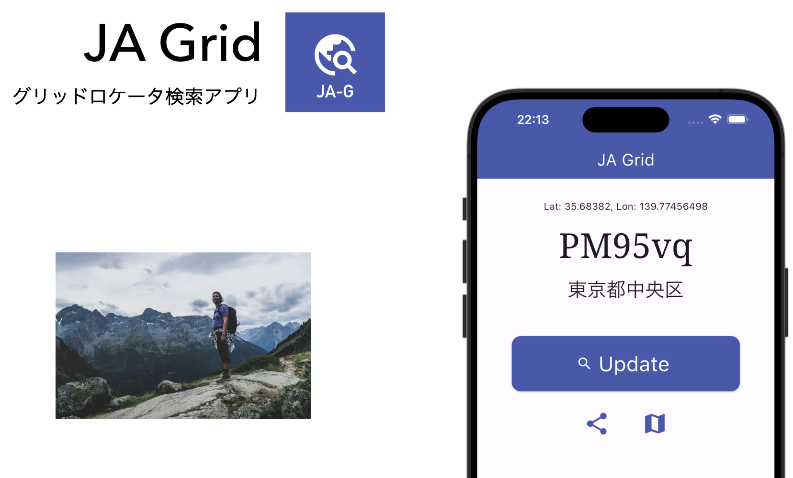

# JA Grid



移動運用のお供に。現在地のグリッドロケータを表示します。


[](LICENSE)

## プライバシーポリシー
アマチュア無線局JS2IIUおよびその免許人は、提供するアプリ「JA Grid」の利用者に関する個人情報を含んだ情報の取り扱いについて、以下のとおりプライバシーポリシーを定めます。

- 取得する個人情報を含んだ情報
  - 本アプリケーションにおいては、現在地情報としてスマホのGPS情報を読み取ります。GPS情報の読み取りにはユーザーによる許可が必要であり、許可されない状態では本アプリケーションがGPSを読み取ることはありません。

- 外部送信、第三者提供、情報収集モジュール
  - スマホのGPS情報を取得して、Yahooデベロッパーネットワークが提供するYahoo!リバースジオコーダAPIに送信して現在地の住所を取得しています。
    - [Yahoo!リバースジオコーダAPI - Yahoo!デベロッパーネットワーク](https://developer.yahoo.co.jp/webapi/map/openlocalplatform/v1/reversegeocoder.html)
  - GPS情報を送信する際に、アプリの利用者を特定する情報など、GPS情報以外は外部送信していません。
  - 情報収集モジュールは使用しておりません。

- お問い合わせ
  - 本アプリケーションおよびプライバシーポリシーに関する、ご意見、ご質問、苦情の申し出その他、個人情報を含んだ情報の取り扱いに関するお問い合わせは、Githubのユーザページに示すSNS経由、もしくはJARLメールにてご連絡ください。

- 改訂
  - アマチュア無線局JS2IIUの裁量に基づき、本ポリシーを変更する可能性があります。ただし、取得する個人情報を含んだ情報の取り扱いに変更が発生した場合は、本Githubリポジトリにて通知いたします。

- 制定日・改訂日
  - 制定: 2023年12月23日

## 参考
### Geolocator
- [geolocator | Flutter Package](https://pub.dev/packages/geolocator/example)
- [flutter geolocationの許可のエラーを解決したい](https://teratail.com/questions/376694)
- [【Flutter】スマホの位置情報を取得するやり方](https://zenn.dev/namioto/articles/3abb0ccf8d8fb6)
- Geolocatorのつまづきポイント
  - `ios/Runner/info.plist`に以下のコードを追加する。`WhenInUseUsage`の`Use`が抜けていた・・・
    ```shell
    <key>NSLocationWhenInUseUseageDescription</key>
	<string>This app needs access to location to show GL on the screen</string>
	<key>NSLocationAlwaysUsageDescription</key>
	<string>This app needs access to location to show GL on the screen</string>
    ```
  - 上記でもうまくいかずに、以下の記載に変更。3項目必要。
    ```shell
    <key>NSLocationWhenInUseUsageDescription</key>
    <string>This app needs access to location when open.</string>
    <key>NSLocationAlwaysUsageDescription</key>
    <string>This app needs access to location when in the background.</string>
    <key>NSLocationAlwaysAndWhenInUseUsageDescription</key>
    <string>This app needs access to location when open and in the background.</string>
    ```
  - `android/app/src/main/AndroidManifest.xml`に以下の2行を追加する。綴りを間違えないように・・・
    ```xml
    <uses-permission android:name="android.permission.ACCESS_COARSE_LOCATION" />
    <uses-permission android:name="android.permission.ACCESS_FINE_LOCATION" />
    ```
  - `android/app/build.gradle`、2箇所修正必要。2箇所あります。1箇所変更してやったつもりになっていましたが、ここに気づくのに大変時間がかかりました。
    ```shell
    compileSdkVersion 33
    ```
    ```shell
    targetSdkVersion 33
    ```
  - Dartコードの中で、位置情報へのアクセス許可ダイアログが出るようにします。ユーザ操作で許可してもらいます。これでようやくGPS情報が取り出せます。位置情報はプライバシーに関わる大事な情報ですからね・・・
    ```dart
    LocationPermission permission = await Geolocator.checkPermission();
    if (permission == LocationPermission.denied) {
        permission = await Geolocator.requestPermission();
        if (permission == LocationPermission.denied) {
            return Future.error('no permission granted......');
        }
    }
    ```

### Grid Locator
- [グリッドロケーター](https://www.jarl.org/Japanese/1_Tanoshimo/1-2_Award/gl.htm)

### 非同期処理
- [Flutter-非同期関数（async）の結果をウィジェットに表示する方法 | Take4-blue](https://take4-blue.com/program/flutter-%E9%9D%9E%E5%90%8C%E6%9C%9F%E9%96%A2%E6%95%B0async%E3%81%AE%E7%B5%90%E6%9E%9C%E3%82%92%E3%82%A6%E3%82%A3%E3%82%B8%E3%82%A7%E3%83%83%E3%83%88%E3%81%AB%E8%A1%A8%E7%A4%BA%E3%81%99%E3%82%8B/)
- [【Flutter】非同期処理のテスト #Flutter - Qiita](https://qiita.com/Seo-4d696b75/items/b677999b4a82fcda11dd)

### 環境変数
- `pubspec.yaml`に`asset:`追加を忘れずに。あと、`.gitignore`にも。
- [Flutterでdotenvを利用して環境変数を管理する方法 | DevelopersIO](https://dev.classmethod.jp/articles/flutter-dotenv/)
- [Flutterでdotenvを使ってみる](https://zenn.dev/someone7140/articles/2d0d65704a5b1e)
  - `await dotenv.load(fileName: ".env")`は`Future main()`の中で。

### Share Button
- [share_plus | Flutter Package](https://pub.dev/packages/share_plus/install)
- [【flutter】アプリにシェア機能を持たせる~Share~ | Programmable](https://www.mechengjp.com/%E3%80%90flutter%E3%80%91%E3%82%A2%E3%83%97%E3%83%AA%E3%81%AB%E3%82%B7%E3%82%A7%E3%82%A2%E6%A9%9F%E8%83%BD%E3%82%92%E6%8C%81%E3%81%9F%E3%81%9B%E3%82%8Bshare/)
- [Flutterでシェア機能を持ったアプリを作成する #Flutter - Qiita](https://qiita.com/yass97/items/9e7c7393f07080ae0105)

## めも
### デバッグが終わったら
- アプリアイコンの設定
    - アイコン画像を`assets/icon`フォルダに。サイズは512x512。
    - `flutter_launcher_icons`パッケージを導入する。[flutter_launcher_icons | Dart Package](https://pub.dev/packages/flutter_launcher_icons)
      ```yaml
      dev_dependencies:
        flutter_launcher_icons: "^0.13.1"

      flutter_icons:
        android: true
        ios: true
        image_path: "assets/icon/JAGridIcon.png"
      ```
    - 以下のコマンドを実行する
    ```sh
    % flutter pub run flutter_launcher_icons:main
    ```
- 画面右上のDEBUGラベルを消す
  - `main.dart`の`home: const MyHomePage(title: 'JA Grid'),`の次の行に挿入する。
    ```dart
    debugShowCheckedModeBanner: false,
    ```
- スクショをとる
  - [【Xcode】シミュレータのスクリーンショットを撮る方法 - Reasonable Code](https://reasonable-code.com/xcode-simulator-screenshot/)
- スマホに表示されるアプリ名を変更する
  - [【Flutter】アプリ名やアイコンの変更とローンチスクリーンの表示](https://isub.co.jp/flutter/flutter-change-app-name-icon-launch-splash-screen/)
  - `android/app/src/main/AndroidManifest.xml`の`android:label`の値を変更
  - `ios/Runner/Info.plist`の`CFBundleName`の値を変更
